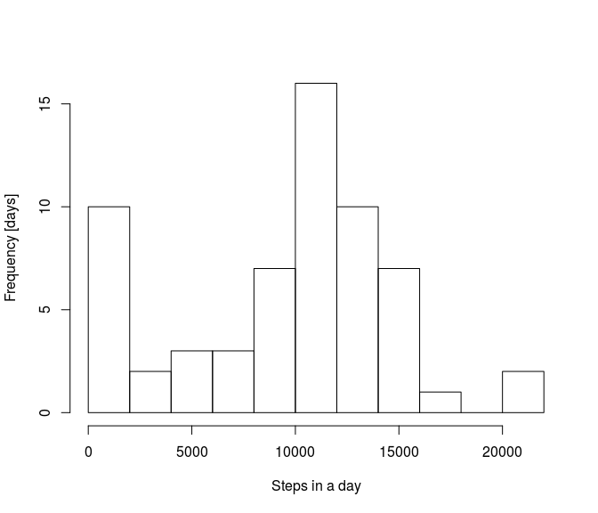
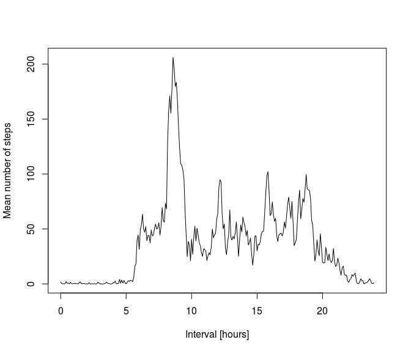
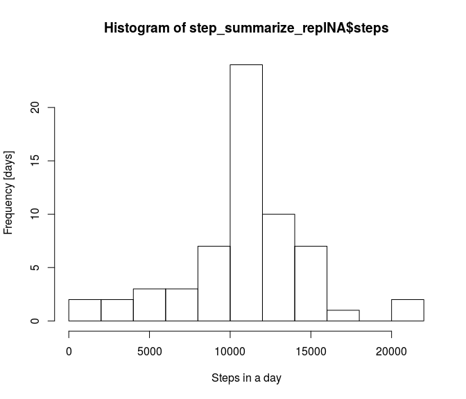
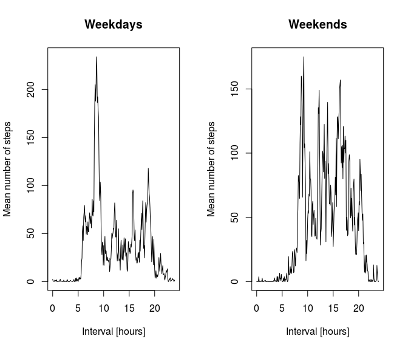

# Reproducible Research: Peer Assessment 1


## Loading and preprocessing the data
Read in the zip-ed activity file and load the dplyr library

```r
  library('dplyr')
```

```
## 
## Attaching package: 'dplyr'
## 
## The following objects are masked from 'package:stats':
## 
##     filter, lag
## 
## The following objects are masked from 'package:base':
## 
##     intersect, setdiff, setequal, union
```

```r
  data <- read.csv(unz("activity.zip", "activity.csv"))
```
Convert string date to real date

```r
  data <- mutate(data, date = as.Date(date, "%Y-%m-%d"))
```
Add column that has interval in minutes

```r
  data <- mutate(data, interval_min = (interval %% 100)+(interval %/%100)*60 )
```


## What is mean total number of steps taken per day?
We group by date

```r
  data_grpdate <- group_by(data,date)
```
Summarize the steps per day 

```r
  step_summarize = summarise_each(data_grpdate,funs(sum(.,na.rm = TRUE)))
```
Make a histogram plot of steps per day:

```r
  hist(step_summarize$steps,breaks=10,xlab='Steps in a day',ylab='Frequency [days]',main="")
```

 

    
Calculate the mean and average stepsize per day

```r
  mean_step_per_day = mean(step_summarize$steps)
  median_step_per_day = median(step_summarize$steps)  
```
The mean steps per day is 9354.2295082.
The median steps per day is 10395.


## What is the average daily activity pattern?
First group the data by 5 min time interval 

```r
   data_grp5min <- group_by(data,interval_min)
```
Summarize the data and take the average of the number of steps per 5 minute interval over all days - remove the NA's

```r
   interval_summarize <- summarise_each(data_grp5min,funs(mean(.,na.rm = TRUE)))
```
Make a plot that shows mean number of steps as a function of 5 minute interval slot

```r
  plot(interval_summarize$interval_min/60,interval_summarize$steps,ylab="Mean number of steps",lty=1,type="l",xlab="Interval [hours]")
```

 


Five minute inteval with maximum average number of steps is at time:

```r
   max_interval <- filter(interval_summarize,steps == max(steps))
   max_interval_time = max_interval$interval  
```
8h35m is the time of maximum number of steps


## Imputing missing values
Count the number of rows with NA - this breaks down to counting the NA's in the steps 

```r
   number_of_NA = sum(is.na(data$steps))
```
There are 2304 NA's in the data frame.

Now we are going to replace the NA with the average number of steps over all days in that specific 5 minute interval. We use a for loop for this, interval_summarize is being used as a lookup table

```r
  avg5minsteps = NULL
  for (i in data$interval_min) {
    avg5minsteps <- c(avg5minsteps,interval_summarize[[i %/% 5 +1 ,2]]) 
  }
  data <- mutate(data,avg5minsteps = avg5minsteps)
```
Next we replace the NA with the mean of the 5 min activity for that time period taken over all days

```r
  data_replNA <- mutate(data, steps = ifelse(is.na(steps), avg5minsteps, steps))  
```
Make the required histograms as we did in the beginning of the asignment
We group by date

```r
  data_replNA_grpdate <- group_by(data_replNA,date)
```
Summarize the steps per day 

```r
  step_summarize_replNA = summarise_each(data_replNA_grpdate,funs(sum(.,na.rm = TRUE)))
```
Make a histogram plot of steps per day:

```r
  hist(step_summarize_replNA$steps,breaks=10,xlab='Steps in a day',ylab='Frequency [days]')
```

 


Calculate the mean and average stepsize per day

```r
  mean_step_per_day_replNA = mean(step_summarize_replNA$steps)
  median_step_per_day_replNA = median(step_summarize_replNA$steps)  
```
The mean steps per day is 9354.2295082 - 1.0766189\times 10^{4} with replaced NA's.
The median steps per day is 10395- 1.0766189\times 10^{4} with replaced NA's.


## Are there differences in activity patterns between weekdays and weekends?
Create an one column containing the weekday and one that holds one if weekend, zero if not
and keep only the necesary columns

```r
  data <- mutate(data,dayOFweek = weekdays(date))
  data <- mutate(data,period = "weekday")
  data <- mutate(data,period = ifelse( dayOFweek == 'Sunday' , "weekend", period))
  data <- mutate(data,period = ifelse( dayOFweek == 'Saturday' , "weekend", period))
  data <- select(data, -c(dayOFweek))
```
Group by period (week or weekend) and per 5 min periods nad calculate the averages


```r
  data_periodgrp_grp5min <- group_by(data,period,interval_min)
  interval_summarize_periodgrp <- summarise_each(data_periodgrp_grp5min,funs(mean(.,na.rm = TRUE)))
```

Make two data sets: weekend and week 

```r
  weekday <- filter(interval_summarize_periodgrp,period == 'weekday')
  weekend <- filter(interval_summarize_periodgrp,period == 'weekend')
```


Make the panel plot

```r
  par(mfrow = c(1, 2))
  plot(weekday$interval_min/60,weekday$steps,ylab="Mean number of steps",lty=1,type="l",xlab="Interval [hours]",col="black",main="Weekdays")

  plot(weekend$interval_min/60,weekend$steps,ylab="Mean number of steps",lty=1,type="l",xlab="Interval [hours]",col="black",main="Weekends")
```

 


